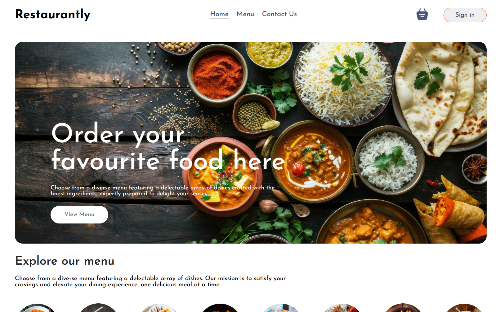

# Restaurantly - Food Booking Web App

Restaurantly is a full-stack food booking web application designed to simplify meal pre-booking and streamline the ordering process. The application consists of three main components: Admin, Backend, and Frontend. It leverages modern web technologies and frameworks to deliver a seamless user experience.

## Table of Contents
- [Features](#features)
- [Technologies Used](#technologies-used)
- [Getting Started](#getting-started)
- [Project Structure](#project-structure)
- [Running the Application](#running-the-application)
- [License](#license)

---

## Features
- User authentication with JWT.
- Secure password handling with bcrypt.
- Admin panel for managing bookings and users.
- Interactive frontend with React.js and React Toastify for notifications.
- Backend with Node.js and Express for API handling.
- Integration with MongoDB Atlas for database management.

---

## Technologies Used
- **Frontend:** React.js, React Toastify
- **Backend:** Node.js, Express.js
- **Database:** MongoDB Atlas
- **Authentication:** JSON Web Token (JWT)
- **Styling:** CSS
- **Other Packages:** bcrypt, cors, and more.

---

## Getting Started

### Prerequisites
Ensure you have the following installed on your system:
- Node.js (v16 or higher)
- npm or pnpm
- MongoDB Atlas account (for database integration)

### Clone the Repository
```bash
git clone https://github.com/lovis-ambrose/Restaurantly.git
cd Restaurantly
```

---

## Project Structure
- **Admin:** Admin panel interface (React.js)
- **Backend:** API and server-side logic (Node.js, Express.js)
- **Frontend:** User-facing interface (React.js)

---

## Running the Application

### Step 1: Navigate to Project Folders
Set up the three components: **Admin**, **Backend**, and **Frontend**.

1. **Admin:**  
   Navigate to the `admin` folder:
   ```bash
   cd admin
   ```
   Install dependencies and start the server:
   ```bash
   pnpm install # or npm install
   pnpm run dev # or npm run dev
   ```
   Access the admin interface at `http://localhost:5173`.

2. **Backend:**  
   Navigate to the `Backend` folder:
   ```bash
   cd ../Backend
   ```
   Install dependencies and start the server:
   ```bash
   pnpm install # or npm install
   pnpm start   # or npm start
   ```

3. **Frontend:**  
   Navigate to the `Frontend` folder:
   ```bash
   cd ../Frontend
   ```
   Install dependencies and start the server:
   ```bash
   pnpm install # or npm install
   pnpm run dev # or npm run dev
   ```
   Access the user interface at `http://localhost:5174`.

---

## Notes
- Ensure all three servers (Admin, Backend, Frontend) are running simultaneously for the app to function correctly.
- Configure the `.env` files for the backend with your MongoDB Atlas connection details and secret keys.

---

## License
This project is licensed under the MIT License. See the [LICENSE](https://github.com/lovis-ambrose/Restaurantly/blob/main/LICENSE) file for details.

---

If you encounter any issues or have suggestions, feel free to open an issue in the [repository](https://github.com/lovis-ambrose/Restaurantly).

Happy coding!
